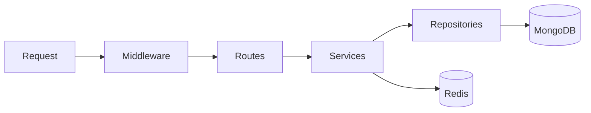

Thank you for considering contributing to Spoo.me! This guide covers everything you need to get started.

<Info>
Join our [Discord community](https://spoo.me/discord) for real-time help and collaboration.
</Info>

## Quick Start

```bash
# Clone your fork
git clone https://github.com/YOUR_USERNAME/spoo.git
cd spoo

# Start everything (MongoDB + Redis + app)
cp .env.example .env
docker compose up -d

# Install tooling for linting and tests
pip install uv
uv sync
uv run pre-commit install
```

Visit http://localhost:8000 - the app hot-reloads on file changes.

<Info>
For local setup without Docker, see the [Local Development Guide](/self-hosting/local-development).
</Info>

## Architecture


```mermaid
graph LR
    A[Request] --> B[Middleware]
    B --> C[Routes]
    C --> D[Services]
    D --> E[Repositories]
    E --> F[(MongoDB)]
    D --> G[(Redis)]
```

**Redirect** (`GET /<alias>`): `redirect_routes.py` → `UrlService.resolve()` (Redis cache → MongoDB fallback) → `ClickService.track_click()` (bot detection, GeoIP, analytics) → 302 redirect.

**Shorten** (`POST /api/v1/shorten`): Auth (optional) → `UrlService.create()` (validate, generate alias, store) → return short URL.

**Stats** (`GET /api/v1/stats`): Auth → `StatsService` (Redis dual cache with stale-while-revalidate) → MongoDB aggregation pipeline.

### Key Directories

| Directory | Role |
|-----------|------|
| `routes/` | Thin request handlers - validate input, call services, return responses |
| `services/` | Business logic - URL CRUD, click tracking, stats, auth, export |
| `repositories/` | MongoDB data access - one per collection |
| `schemas/` | Pydantic models - `models/` for DB documents, `dto/` for request/response |
| `infrastructure/` | External integrations - Redis cache, GeoIP, email, OAuth clients |
| `dependencies/` | FastAPI DI - auth guards, service providers |
| `middleware/` | Rate limiting, error handlers, security headers, logging |
| `shared/` | Cross-cutting - bot detection, validators, crypto, generators |
| `tests/` | ~90% coverage - `unit/` (mocked) + `integration/` (TestClient) |

### Design Patterns

| Pattern | Where | Why |
|---------|-------|-----|
| **Layered architecture** | Routes → Services → Repositories | Routes are thin, logic lives in services |
| **Repository pattern** | `repositories/` | Isolates MongoDB queries behind a clean interface |
| **Dependency injection** | `dependencies/` via FastAPI `Depends()` | Easy to test and swap |
| **Strategy pattern** | `services/click/` - V2Handler vs LegacyHandler | Different click tracking per URL schema |
| **Stale-while-revalidate** | `infrastructure/cache/dual_cache.py` | Serve stale stats instantly, refresh in background |
| **Domain errors** | `errors.py` | Typed exceptions mapped to HTTP status codes by middleware |

## Development Workflow

<Steps>
<Step title="Create a Branch">
```bash
git fetch upstream && git checkout main && git merge upstream/main
git checkout -b feature/my-feature
```
</Step>

<Step title="Make Changes">
- Follow the layered architecture (routes → services → repositories)
- Add tests for new features
- Use domain error classes from `errors.py`
</Step>

<Step title="Test and Lint">
Pre-commit hooks run automatically, but you can also run manually:

```bash
uv run ruff check . --fix    # Lint
uv run ruff format .          # Format
uv run pytest                  # Tests
```
</Step>

<Step title="Commit and Push">
Follow [conventional commits](https://www.conventionalcommits.org/):

```bash
git commit -m "feat(api): add custom alias endpoint"
git push origin feature/my-feature
```

**Types:** `feat`, `fix`, `docs`, `refactor`, `test`, `chore`
</Step>

<Step title="Open a Pull Request">
```bash
gh pr create --title "Add custom alias endpoint"
```

PR checklist:
- [ ] `uv run ruff check .` and `uv run ruff format --check .` pass
- [ ] `uv run pytest` passes
- [ ] New features have tests
- [ ] Branch is up to date with main
</Step>
</Steps>

## Testing

```bash
uv run pytest                                              # Full suite
uv run pytest tests/unit/services/test_click_service.py -v # Specific file
uv run pytest -k "test_v2"                                  # By name pattern
```

- **Unit tests** (`tests/unit/`) - `AsyncMock` dependencies, test service logic in isolation
- **Integration tests** (`tests/integration/`) - `TestClient` for full request/response cycles
- **Smoke tests** (`tests/shorten.py`, `tests/stats.py`) - run against live instance in CI

### CI with GitHub Actions

We provide the [Spoo.me Setup Action](https://github.com/spoo-me/setup-action) for testing in CI:

```yaml
- uses: spoo-me/setup-action@v2
  id: spoo
- run: curl -s ${{ steps.spoo.outputs.health-url }}
```

<Card title="GitHub Action Guide" icon="workflow" href="/tools/github-action">
Full setup action documentation
</Card>

## Style Guide

**Code**: Ruff linting + formatting, enforced via pre-commit. Line length 88, isort imports, no `print()` (use `structlog`).

**Commits**: [Conventional commits](https://www.conventionalcommits.org/) - `feat(scope): description`.

**Frontend**: Jinja2 templates in `templates/`, static assets in `static/`. Increment cache-busting version (`?v=N`) when modifying static files.

## Getting Help

<CardGroup cols={2}>
<Card title="Discord" icon="discord" href="https://spoo.me/discord">
    Real-time help and collaboration.
</Card>

<Card title="Issues" icon="bug" href="https://github.com/spoo-me/spoo/issues">
    Report bugs and request features.
</Card>
</CardGroup>

---

Ready? [Fork the repository](https://github.com/spoo-me/spoo/fork) and start contributing!

<Frame>
    
</Frame>
