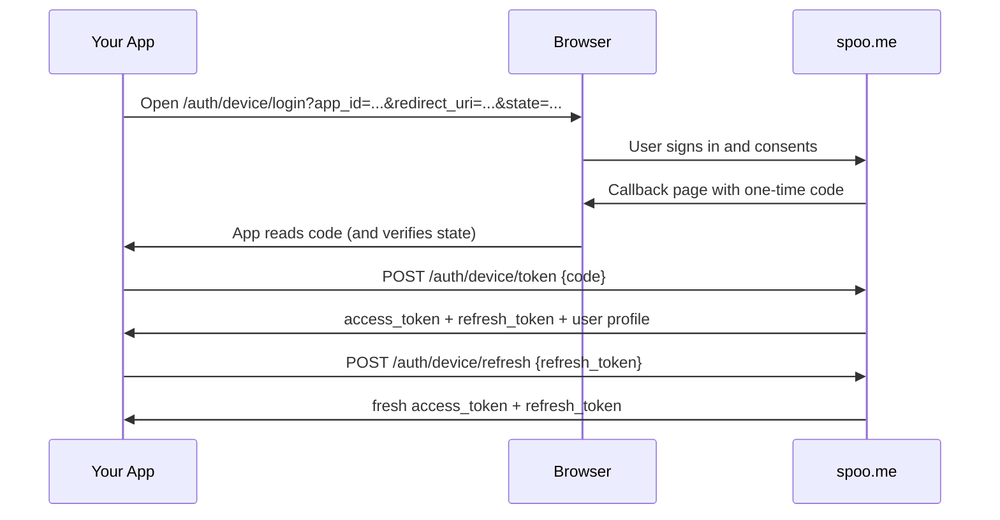

Device authentication is the flow used by Spoo.me client applications (browser extensions, CLIs, desktop apps) to act on behalf of a user without handling their password. The user approves the app once in their browser; the app receives JWT tokens it can use and refresh.

<Note>
  The flow is available to **registered applications**. The `app_id` is validated against the Spoo.me app registry, and the `redirect_uri` must match the app's registered URIs. If you are building an integration and want your app registered, [contact us](https://spoo.me/contact).
</Note>

## Flow Overview



<Steps>
<Step title="Start the flow in a browser">
    Open the device login page with your app's identity:

    ```
    https://spoo.me/auth/device/login?app_id=YOUR_APP_ID&redirect_uri=YOUR_REGISTERED_URI&state=RANDOM_STATE
    ```

    If the user is not signed in, they are taken through login first. If they have previously approved your app, the consent screen is skipped and a code is issued immediately.
</Step>

<Step title="Receive the one-time code">
    After consent, the browser lands on the callback page carrying the auth `code` and your `state`. Verify that `state` matches the value you sent before using the code.
</Step>

<Step title="Exchange the code for tokens">
    ```bash
    curl -X POST https://spoo.me/auth/device/token \
      -H "Content-Type: application/json" \
      -d '{"code": "THE_ONE_TIME_CODE"}'
    ```

    The response contains an `access_token`, a `refresh_token`, and the user's profile. The code is single-use.
</Step>

<Step title="Refresh tokens when they expire">
    ```bash
    curl -X POST https://spoo.me/auth/device/refresh \
      -H "Content-Type: application/json" \
      -d '{"refresh_token": "YOUR_REFRESH_TOKEN"}'
    ```

    Unlike the cookie-based session refresh, this endpoint accepts the refresh token in the request body, which suits non-browser clients.
</Step>
</Steps>

## Revocation

Users can revoke an app's access at any time from their dashboard. Once revoked, the app's pending codes stop exchanging and its refresh tokens stop refreshing. Handle authentication errors by restarting the flow.

## Rate Limits

| Endpoint | Limit |
|----------|-------|
| `POST /auth/device/token` | 10/min |
| `POST /auth/device/refresh` | 20/min |

## Next Steps

<CardGroup cols={2}>
  <Card title="API Reference" icon="code" href="/api-reference">
    Request and response schemas for the device endpoints
  </Card>
  <Card title="API Keys" icon="key" href="/api-keys">
    Prefer API keys for server-side automation under your own account
  </Card>
</CardGroup>
