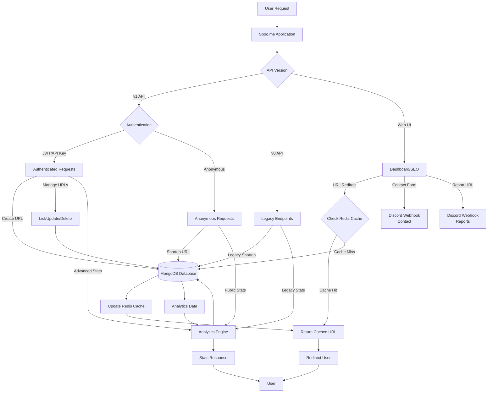

Spoo.me offers multiple deployment methods to suit different technical expertise levels and infrastructure preferences. Each method provides varying degrees of control, customization, and complexity.

<Info>
Our support is tailored to individual needs. Should you have any inquiries, we invite you to pose them on our [Discord server](https://spoo.me/discord).
</Info>

## Server Architecture

Understanding how Spoo.me works will help you choose the right deployment method and configuration for your needs.

<Frame>

</Frame>

## Prerequisites

Before deploying Spoo.me, you'll need to set up the following components:

<Steps>
<Step title="Set up MongoDB Database">
    MongoDB is required to store URLs, analytics, and user data. We recommend using MongoDB Atlas for its free tier and ease of setup.
    
    <Card title="MongoDB Setup Guide" icon="database" href="/self-hosting/setting-up-mongo">
        Complete guide to setting up MongoDB Atlas or self-hosted MongoDB
    </Card>
</Step>

<Step title="Create Discord Webhooks">
    Webhooks are needed for the contact form and URL reporting functionality.
    
    <Card title="Webhook Creation Guide" icon="webhook" href="/self-hosting/creating-contact-webhooks">
        Step-by-step instructions for creating Discord webhooks
    </Card>
</Step>
</Steps>

## Deployment Methods

Choose the deployment method that best fits your technical expertise and requirements:

<CardGroup cols={2}>
<Card title="Cloud Deployment" icon="cloud" href="/self-hosting/deployment/cloud-deployment">
    **Recommended for beginners**
    
    Deploy with one-click using platforms like Vercel, Railway, or Render. Perfect for getting started quickly with minimal configuration.
    
    - ✅ Easy setup
    - ✅ Free hosting options
    - ✅ Automatic scaling
    - ❌ Limited customization
</Card>

<Card title="Docker Deployment" icon="docker" href="/self-hosting/deployment/docker-deployment">
    **For intermediate users**
    
    Use Docker containers for consistent deployment across different environments. Ideal for users familiar with containerization.
    
    - ✅ Consistent environment
    - ✅ Easy scaling
    - ✅ Good customization
    - ⚠️ Requires Docker knowledge
</Card>

<Card title="Local Development" icon="code" href="/self-hosting/deployment/local-development">
    **For advanced users**
    
    Manual setup with full control over the environment. Best for development, testing, and maximum customization.
    
    - ✅ Full control
    - ✅ Maximum customization
    - ✅ Best for development
    - ❌ Requires technical expertise
</Card>

<Card title="Redis Setup (Optional)" icon="memory" href="/self-hosting/setting-up-redis">
    **Performance Enhancement**
    
    Optional Redis configuration for improved caching and performance in high-traffic deployments.
    
    - ✅ Better performance
    - ✅ Caching support
    - ⚠️ Additional complexity
</Card>
</CardGroup>

## What You'll Get

After successful deployment, your self-hosted Spoo.me instance will include:

### API v1 Features
- 🔐 **API Key Authentication**: Create and manage API keys with scoped permissions
- 🔗 **URL Management**: List, update, and delete shortened URLs programmatically
- 📊 **Advanced Analytics**: Flexible filtering, grouping, and time-series analysis
- 🔒 **Private Statistics**: Option to make URL stats private to owner only
- 🚀 **Higher Rate Limits**: 60 requests/min for authenticated users vs 20/min for anonymous
- ⏱️ **URL Expiration**: Set expiration dates and click limits
- 🤖 **Bot Blocking**: Block known bots from accessing URLs
- 🔑 **Password Protection**: Secure URLs with passwords

### Legacy v0 Features
- 🔗 **URL Shortening**: Classic URL shortening with form-based API
- 😄 **Emoji URLs**: Create memorable emoji-based short URLs
- 📈 **Basic Analytics**: Simple statistics and click tracking
- 📥 **Data Export**: Export URL data in JSON, CSV, XLSX, XML formats

### Web Dashboard & UI
- 📱 **Responsive Design**: Works perfectly on all devices
- 🎨 **Modern Interface**: Clean, intuitive dashboard for URL management
- 🛡️ **Security Features**: Built-in protection against abuse
- 📧 **Contact Forms**: Direct communication with webhook integration
- 🚨 **URL Reporting**: Allow users to report problematic URLs

<Tip>
For the best experience, ensure you have completed the prerequisite steps (MongoDB and webhooks) before proceeding with any deployment method.
</Tip>
