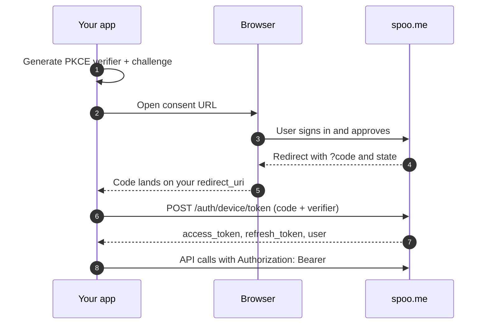

## What is Sign in with Spoo?

Sign in with Spoo lets your application act on behalf of a Spoo.me user without ever touching their password or asking them to paste an API key. Your app sends the user through a browser consent screen once, receives its own scoped tokens, and shows up on the user's dashboard as a connected app they can revoke at any time.

Under the hood it is a PKCE-secured device authorization flow: your app opens a consent URL, the user approves, and your app exchanges a short-lived code for tokens.

<Note>
  **Connected apps vs API keys**: API keys are for automating *your own* account. Sign in with Spoo is for software that *other people* use with *their* accounts, with a consent screen, scoped grants, and per-app revocation.
</Note>

## What you can build

Anything that can open a browser and receive a code can use this flow. The official apps are all open source and cover the common shapes:

<CardGroup cols={3}>
  <Card title="Spoo CLI" icon="terminal" href="https://github.com/spoo-me/spoo-cli">
    Terminal app using a loopback redirect and a throwaway local listener
  </Card>
  <Card title="Browser Extension" icon="puzzle-piece" href="https://github.com/spoo-me/spoo-snap">
    Chrome and Firefox extension capturing the code from the hosted callback page
  </Card>
  <Card title="Raycast Extension" icon="rocket" href="https://github.com/spoo-me/spoo-raycast">
    Built on Raycast's PKCE client, pointed at the Spoo.me consent endpoint
  </Card>
</CardGroup>

Your app can be any of these, or something else entirely: a desktop app, an editor plugin, a chat bot, an automation platform integration.

## The flow at a glance

## Where to go next

<CardGroup cols={2}>
  <Card title="Authorization Flow" icon="route" href="/sign-in-with-spoo/authorization-flow">
    The step-by-step protocol: PKCE, the consent URL, code exchange, and refresh
  </Card>
  <Card title="Registering Your App" icon="badge-check" href="/sign-in-with-spoo/registering-your-app">
    Develop locally today, then get your app registered and verified for production
  </Card>
  <Card title="Platform Patterns" icon="shapes" href="/sign-in-with-spoo/platform-patterns">
    How the official CLI, extension, and Raycast apps each capture the code
  </Card>
  <Card title="Tokens & Scopes" icon="key" href="/sign-in-with-spoo/tokens-and-scopes">
    Token lifetimes, refresh rotation, the scope model, and revocation semantics
  </Card>
</CardGroup>
